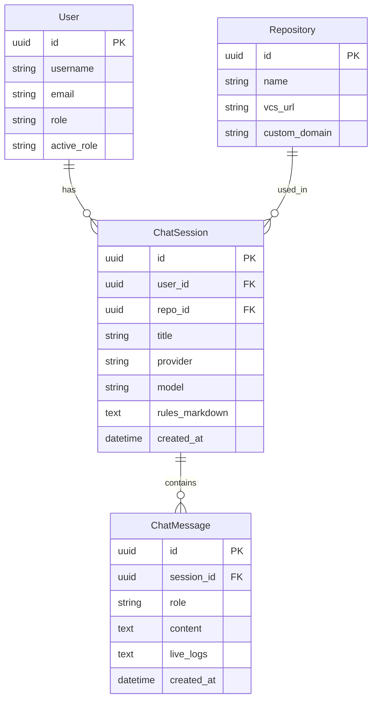

# Lattice Feasibility Evaluator

Lattice Feasibility Agent is a specialized system designed to evaluate feature requests against existing codebases. It determines if a proposed feature is technically feasible by searching the codebase, verifying dependency/guardrail rules, and synthesizing a detailed feasibility report.

## Intent of the Project
The primary intent of Lattice is to act as an automated Technical Product Manager / Architect. It saves engineering time by performing initial technical due diligence on new feature ideas. It analyzes the chat history, searches the codebase for relevant context, evaluates repository-specific rules, and provides a clear, actionable Markdown report on how (and if) the feature can be implemented.

## Architecture & LangGraph Flow
The backend is built with **FastAPI** and uses **LangGraph** to orchestrate the agentic workflow. The agent executes a state machine (`StateGraph`) with the following nodes:

1. **`parse`**: Analyzes the user's natural language feature request and chat history to extract highly relevant search keywords.
2. **`search`**: Connects to the target repository (via GitHub API, Sourcegraph, or Local File Scanner) to query the codebase using the extracted keywords and retrieve code snippets.
3. **`clarify`**: Evaluates the feature request against a SMART criteria rubric. If the request is too vague, it halts the generation and asks the user a clarifying question.
4. **`evaluate`**: Checks the retrieved code snippets against repository-specific guardrails and dependency rules (e.g., "Do not modify this core auth file").
5. **`synthesize`**: Acts as a Senior Product Architect to synthesize the final Markdown feasibility report, outlining what can be implemented, constraints, and triggered rules.

## State Persistence Across Chats
While LangGraph handles the state execution for a single interaction turn, **Lattice uses a custom PostgreSQL database layer to maintain persistent state across multiple chat turns.**

Instead of relying on LangGraph's built-in SQLite checkpointer, Lattice persists `ChatSession` and `ChatMessage` records in the database. When a user sends a follow-up prompt in an existing session:
1. The FastAPI backend (`streaming.py`) retrieves the entire chat history for that session from the database.
2. It injects this history into the LangGraph `AgentState` under the `chat_history` key.
3. The LangGraph nodes (like `parse`, `clarify`, and `synthesize`) use this history to maintain full contextual awareness of the ongoing conversation, ensuring seamless follow-up evaluations.

## Database Schema

